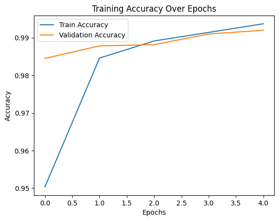

# Hand-Written-Digit-Recongnition-System

This project is a deep learning-based solution that classifies handwritten digits (0–9) using the MNIST dataset. It uses a **Convolutional Neural Network (CNN)** architecture built with **TensorFlow/Keras** and supports predictions from **custom uploaded digit images**. The model achieves high classification performance with a final test accuracy of **99.14%**.

---

## Problem Statement

Recognizing handwritten digits is essential in fields like postal automation, bank check processing, and form digitization. Manual classification is slow and error-prone. This project automates digit recognition using deep learning, making the process fast, reliable, and highly accurate.

---

## Objectives

- Load and preprocess the **MNIST** dataset.
- Build and train a CNN model for digit classification.
- Achieve high accuracy on both training and testing data.
- Support predictions from custom user-uploaded images.
- Display prediction results and training performance.

---

## Tech Stack

| Tool              | Purpose                                      |
|-------------------|----------------------------------------------|
| Python            | Core programming language                    |
| TensorFlow/Keras  | Deep learning model development              |
| OpenCV            | Preprocessing custom digit images            |
| NumPy             | Numerical operations                         |
| Matplotlib        | Accuracy plots & displaying predictions      |
| Google Colab      | Training and interactive experimentation     |

---

## How It Works

### 1. Data Preparation
- **Dataset**: MNIST (60,000 training + 10,000 test images)
- Image Size: 28×28 grayscale pixels
- Pixel values are normalized to the [0, 1] range.
- Images are reshaped to (28, 28, 1) format for CNN input.
- Labels are one-hot encoded for 10 classes (0–9).

---

### 2. CNN Architecture

```
Input Shape: (28, 28, 1)
↓
Conv2D(32 filters, 3x3) + ReLU
↓
MaxPooling2D(2x2)
↓
Conv2D(64 filters, 3x3) + ReLU
↓
MaxPooling2D(2x2)
↓
Flatten
↓
Dense(128 units, ReLU)
↓
Dense(10 units, Softmax)
```

### 3. Model Training & Evaluation
- **Optimizer**: Adam
- **Loss Function**: Categorical Crossentropy
- **Epochs**: 5
- **Batch Size**: 64
- **Validation Split**: 10%

Model is trained using:

```python
model.fit(x_train, y_train, epochs=5, batch_size=64, validation_split=0.1)
```

It is evaluated on 10,000 test samples:

```python
test_loss, test_accuracy = model.evaluate(x_test, y_test)
```

**Final Test Accuracy**: 99.14%

### 4. Custom Image Prediction
Users can upload their own handwritten digit image for prediction:

- Image is converted to grayscale.
- Resized to 28×28 pixels.
- Pixel values normalized to [0, 1].
- Inverted if background is black.
- Image is reshaped to (1, 28, 28, 1).
- Model predicts the digit using .predict() and result is displayed using Matplotlib.

---

## Sample Outputs

### Accuracy Plot


Shows the model's training and validation accuracy across 5 epochs.

---

### Custom Image Prediction


**Predicted Digit: 6**

Displays the uploaded image and the predicted digit.

---

### Training Progress


Visual representation of the model's learning process during training.

---

## Model Performance

| Metric               | Value    |
|---------------------|----------|
| Training Accuracy    | ~99.4%   |
| Validation Accuracy  | ~99.2%   |
| Test Accuracy        | 99.14%   |
| Loss                 | ~0.042   |
| Epochs               | 5        |
| Optimizer            | Adam     |

---

## How to Run the Project

### On Google Colab
1. Open the notebook `handwritten_digit_recognition.ipynb` in Google Colab.
2. Run all cells in order.
3. Upload your own digit image using the file upload widget.
4. View predicted result and output visualization.

### Locally
```bash
# Clone the repository
git clone https://github.com/your-username/handwritten-digit-recognition.git
cd handwritten-digit-recognition

# Install dependencies
pip install -r requirements.txt

# Launch the notebook
jupyter notebook handwritten_digit_recognition.ipynb
```
